# AI-Powered CRM Intelligence Platform

A production-style fullstack AI CRM platform that helps businesses import customer data, analyze customer interactions, detect risks and opportunities, generate prioritized AI actions, and manage customers through a Customer 360 workspace.

This project is built as a portfolio-level AI + Fullstack Engineering project. It demonstrates real-world backend architecture, meaningful AI integration, business workflow thinking, and professional SaaS-style frontend UX.

---

## Project Overview

This CRM system is not a simple CRUD app or a basic chatbot demo.

The core idea is:

```txt
Customers + Orders + Customer Signals
→ AI analyzes customer and business context
→ AI generates prioritized actions
→ Dashboard summarizes business priorities
→ Customer 360 shows full account context
→ User executes actions from the Action Center
→ AI Copilot answers CRM business questions
```

The platform helps a business understand customers, identify risks, find growth opportunities, and turn AI insights into executable business actions.

---

## Live Product Flow

The main product flow is:

```txt
Import business data
→ Analyze customer signals
→ Generate AI actions
→ Review dashboard insights
→ Open Customer 360
→ Execute actions
→ Ask the AI Copilot for business recommendations
```

This makes the project feel like a real AI-powered CRM SaaS system rather than a collection of disconnected features.

---

## Screenshots

### AI Command Center Dashboard

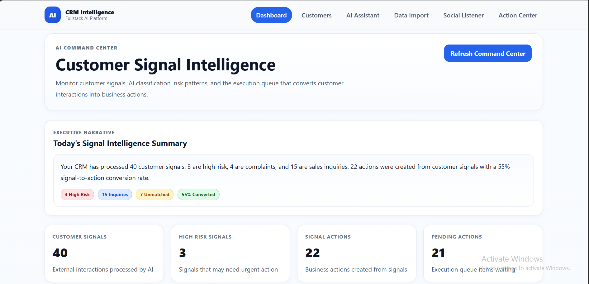

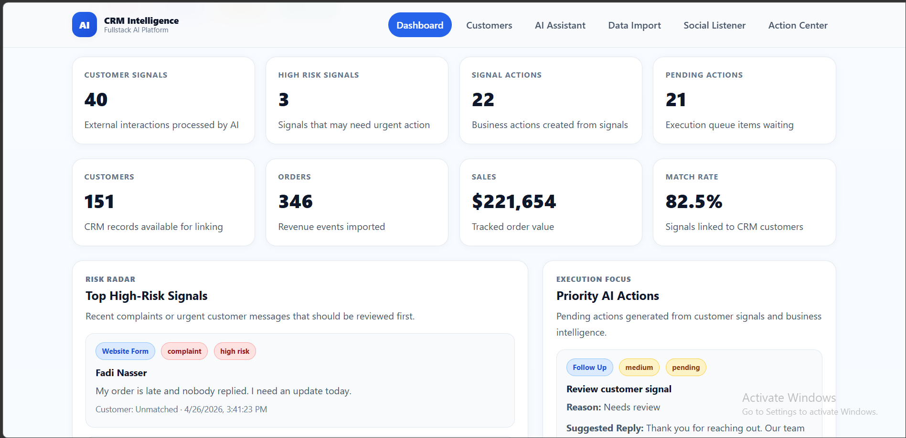

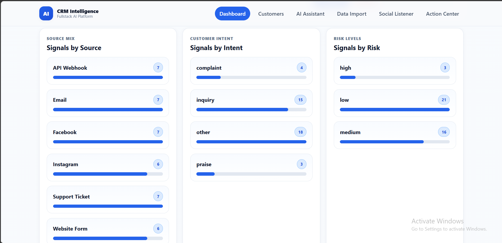

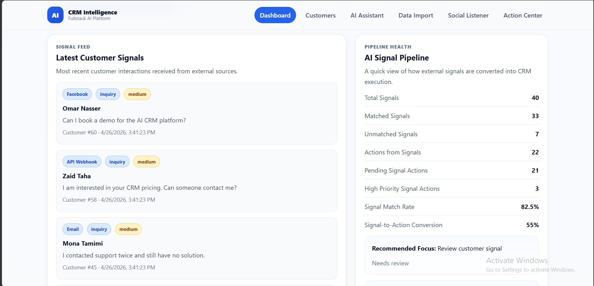

---

### Account Intelligence List

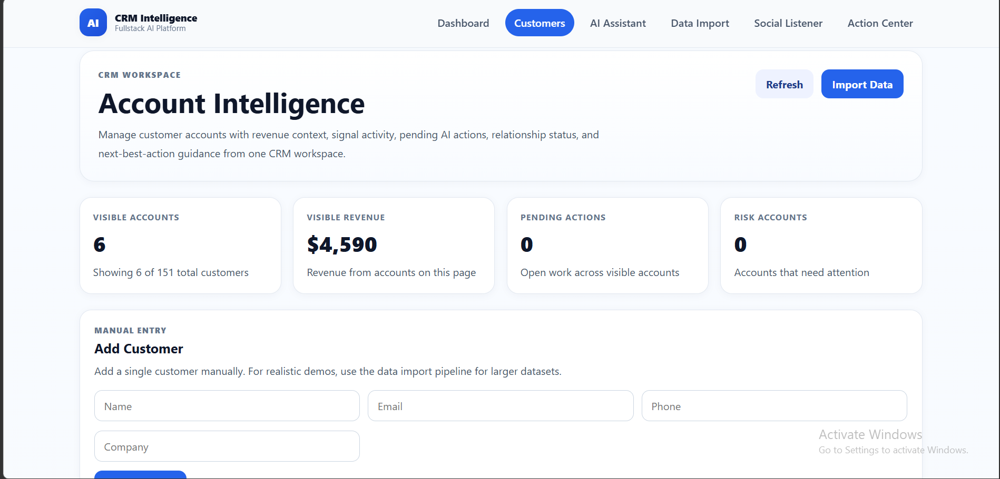

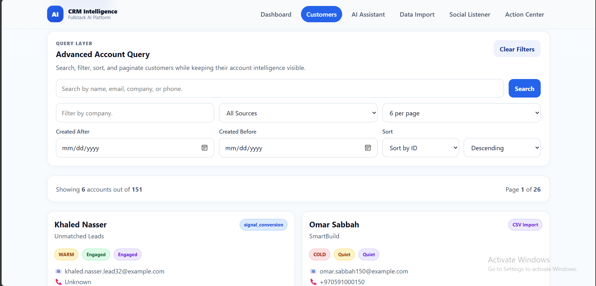

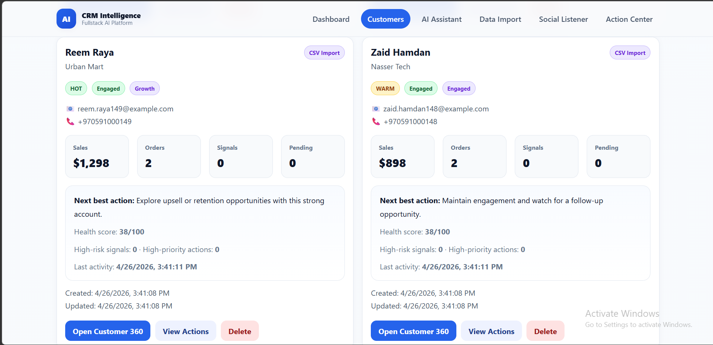

---

### Customer 360 Workspace

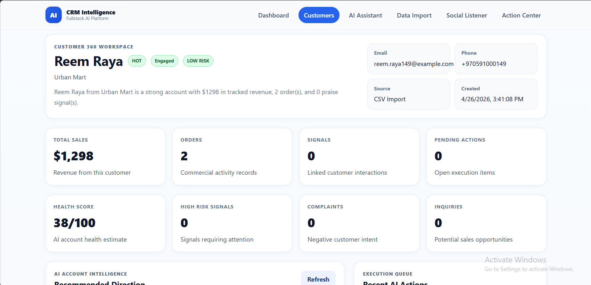

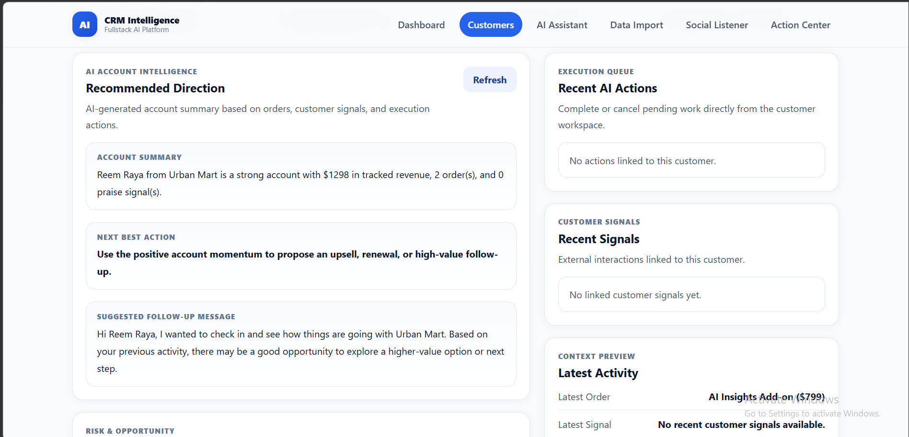

---

### AI CRM Copilot

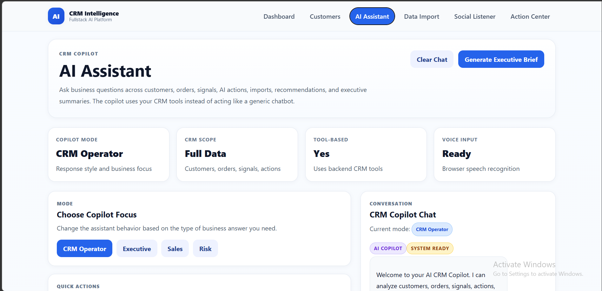

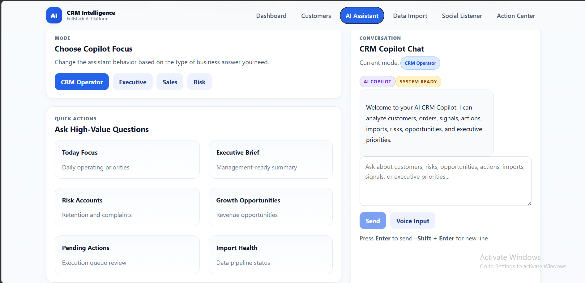

---

### Data Import Pipeline

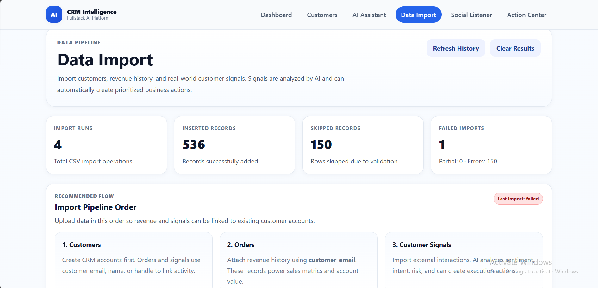

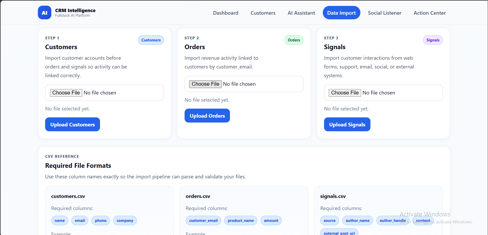

---

### Social Listener / Customer Signal Inbox

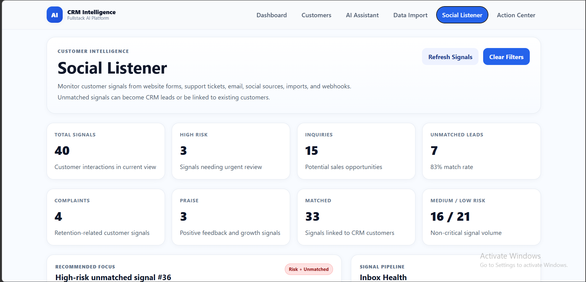

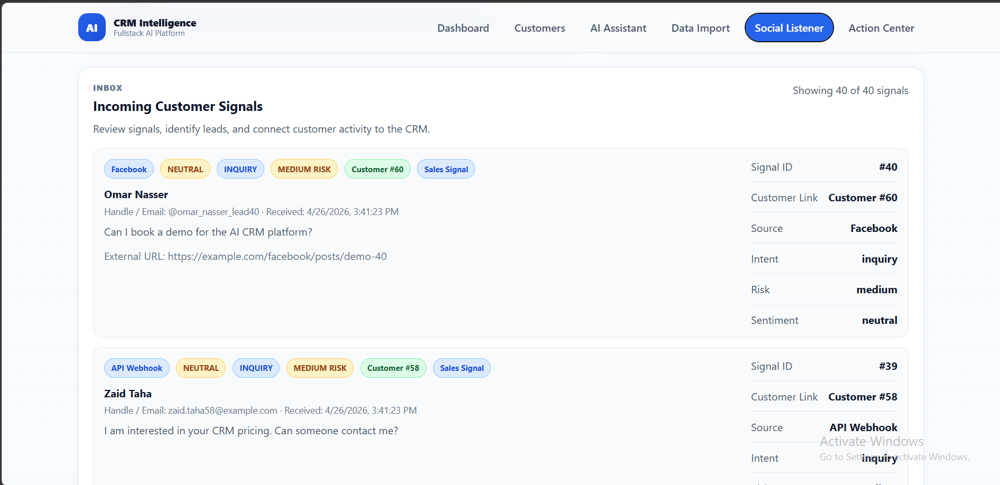

---

### Action Center

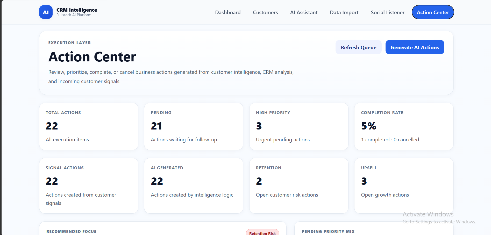

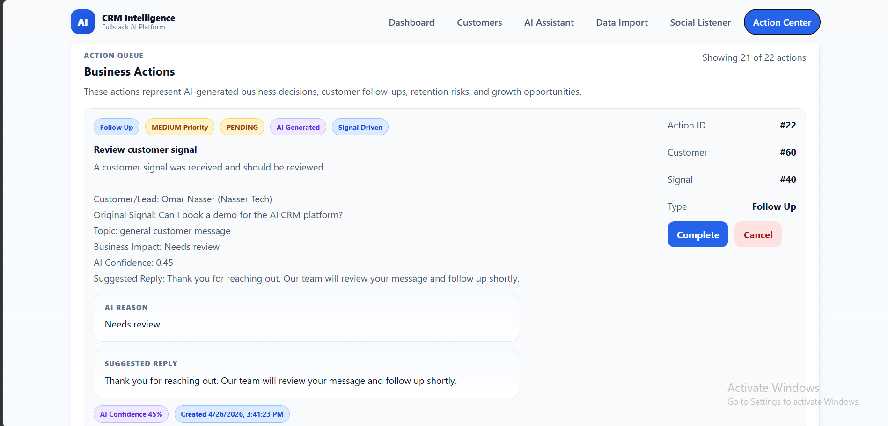

---

## Key Features

### 1. AI Command Center Dashboard

The dashboard provides an executive-level view of the CRM.

It shows:

- Total customers
- Total orders
- Total sales
- Total customer signals
- High-risk signals
- Pending AI actions
- Signal-to-action conversion rate
- Signal match rate
- Latest customer signals
- Priority actions
- Signals by source
- Signals by intent
- Signals by risk level

The dashboard explains the value of the product immediately.

---

### 2. Account Intelligence List

The Customers page is upgraded from a basic customer list into an account intelligence workspace.

Each customer includes:

- Customer profile
- Total sales
- Total orders
- Linked signals
- Pending actions
- High-risk signals
- Health status
- Relationship status
- Next best action

This makes the CRM feel like a real account management tool instead of a simple contact database.

---

### 3. Customer 360 Workspace

The Customer 360 page gives a full view of a customer account.

It answers:

- Who is this customer?
- How valuable is this customer?
- What happened recently?
- Is the customer at risk?
- What should the business do next?

It includes:

- Customer profile
- Revenue history
- AI health score
- Risk level
- Relationship status
- AI account summary
- Risk assessment
- Opportunity assessment
- Suggested follow-up message
- Recent orders
- Recent customer signals
- Recent AI actions
- Complete/cancel action controls

---

### 4. Social Listener / Customer Signal Inbox

The Social Listener page acts as an inbox for external customer interactions.

Customer signals can come from:

- Website forms
- Support tickets
- Emails
- Facebook
- Instagram
- API webhooks
- CSV imports

Each signal is analyzed and classified by AI.

AI extracts:

- Sentiment
- Intent
- Risk level
- Business impact
- Recommended action type
- Recommended priority
- Suggested reply

Unmatched signals can be:

- Converted into new customers
- Linked to existing customers

This turns external interactions into CRM opportunities.

---

### 5. AI Action Center

The Action Center is the execution layer of the CRM.

It shows business actions generated from AI analysis and CRM intelligence.

Action types include:

- Follow-up
- Retention
- Upsell
- Review
- Data cleanup

Each action includes:

- Action type
- Priority
- Status
- AI reason
- Suggested reply
- AI confidence
- Linked customer
- Linked signal

Users can:

- Complete actions
- Cancel actions
- Generate new AI actions

This proves that the AI does not only generate text. It creates work that a business user can execute.

---

### 6. Data Import Pipeline

The Data Import page supports bulk onboarding of CRM data.

Supported CSV files:

#### customers.csv

```csv
name,email,phone,company
Ahmad Saleh,ahmad@example.com,+970599000000,Nablus Retail Co
```

#### orders.csv

```csv
customer_email,product_name,amount
ahmad@example.com,CRM Pro Plan,1200
```

#### signals.csv

```csv
source,author_name,author_handle,content,external_post_url
support_ticket,Ahmad Saleh,ahmad@example.com,The delivery was late and I need help.,https://example.com/ticket/1001
```

Recommended import flow:

```txt
customers → orders → customer signals
```

This makes the system feel like a real SaaS onboarding pipeline.

---

### 7. AI CRM Copilot

The AI Assistant acts as a CRM Copilot connected to backend CRM tools.

It can answer questions like:

- What should I focus on today?
- Give me an executive CRM brief.
- Which customers are at risk?
- Which customers are growth opportunities?
- Summarize pending actions.
- Show recent import history.
- Summarize a specific customer.
- What are the biggest business risks?

The assistant is designed to use CRM data instead of acting like a generic chatbot.

---

## Tech Stack

### Backend

- FastAPI
- SQLAlchemy ORM
- SQLite
- Modular service-based architecture
- Groq API for LLaMA-based AI analysis
- ChromaDB / RAG support

### Frontend

- React
- Vite
- React Router
- Axios
- Custom CSS SaaS dashboard styling

### AI

- Groq API
- LLaMA model integration
- AI signal analysis
- AI-generated actions
- CRM Copilot tool routing
- Business brain recommendations
- Executive brief generation

---

## Backend Architecture

The backend is organized into:

```txt
backend/
└── app/
    ├── models/
    ├── routes/
    ├── services/
    ├── database.py
    └── main.py
```

### Models

- Customer
- Order
- SocialSignal
- Action
- ImportLog
- Note

### Routes

- customers
- orders
- imports
- social_listener
- actions
- dashboard
- ai
- notes

### Services

- customer_service
- dashboard_service
- business_brain_service
- recommendation_service
- action_service
- action_generation_service
- import_service
- executive_brief_service
- rag_service

---

## Frontend Architecture

The frontend is organized into:

```txt
frontend/
└── src/
    ├── components/
    ├── pages/
    ├── services/
    ├── styles/
    ├── App.jsx
    └── main.jsx
```

### Main Pages

- Dashboard
- Customers
- CustomerDetails
- AIChat
- ActionCenter
- DataImport
- SocialListener

---

## Main Data Models

### Customer

Represents a CRM customer/account.

Fields include:

- id
- name
- email
- phone
- company
- source
- created_at
- updated_at

### Order

Represents revenue activity linked to customers.

Fields include:

- id
- customer_id
- product_name
- amount
- source
- created_at

### SocialSignal / Customer Signal

Represents an external customer interaction.

Fields include:

- id
- customer_id
- source
- author_name
- author_handle
- content
- sentiment
- intent
- risk_level
- external_post_url
- created_at

Note: The model is currently named `SocialSignal`, but conceptually it represents a general customer signal from multiple sources.

### Action

Represents executable CRM work generated by AI or added manually.

Fields include:

- id
- customer_id
- signal_id
- action_type
- title
- description
- reason
- suggested_reply
- ai_confidence
- priority
- status
- source
- created_at
- completed_at

### ImportLog

Tracks CSV import operations.

Fields include:

- id
- entity_type
- file_name
- inserted_count
- skipped_count
- error_count
- status
- created_at

---

## AI Workflow

### 1. Signal Analysis

When a customer signal is ingested, AI analyzes the content and extracts:

- Sentiment
- Intent
- Risk level
- Urgency
- Topic
- Business impact
- Confidence
- Recommended action type
- Recommended priority
- Recommended action title
- Recommended action description
- Suggested reply

### 2. Action Generation

AI-generated actions are created from:

- High-risk signals
- Complaints
- Sales inquiries
- Business priorities
- Growth opportunities
- At-risk accounts

### 3. Business Brain

The business brain analyzes:

- Customers
- Orders
- Signals
- Actions
- Import health

It produces:

- Top priorities
- Biggest risks
- Growth opportunities
- Operational warnings
- Executive summary
- Action plan

### 4. CRM Copilot

The AI Copilot can use backend CRM tools to answer business questions about:

- Customers
- Revenue
- Risks
- Opportunities
- Import history
- Actions
- Executive summaries

---

## How To Run The Project

### 1. Clone The Repository

```bash
git clone https://github.com/QaisBkhaitan/ai-crm-intelligence-platform.git
cd ai-crm-intelligence-platform
```

### 2. Backend Setup

Go to the backend folder:

```bash
cd backend
```

Create a virtual environment:

```bash
python -m venv venv
```

Activate the virtual environment:

Windows:

```bash
venv\Scripts\activate
```

macOS / Linux:

```bash
source venv/bin/activate
```

Install dependencies:

```bash
pip install -r requirements.txt
```

Create a `.env` file inside the backend folder:

```env
GROQ_API_KEY=your_groq_api_key_here
```

Run the backend:

```bash
uvicorn app.main:app --reload
```

Backend runs on:

```txt
http://127.0.0.1:8000
```

Swagger API docs:

```txt
http://127.0.0.1:8000/docs
```

### 3. Frontend Setup

Open a new terminal and go to the frontend folder:

```bash
cd frontend
```

Install dependencies:

```bash
npm install
```

Run the frontend:

```bash
npm run dev
```

Frontend runs on:

```txt
http://localhost:5173
```

---

## Demo Flow

For the best demo, use this flow:

### 1. Import Customers

Go to:

```txt
Data Import → Upload customers.csv
```

### 2. Import Orders

Upload:

```txt
orders.csv
```

Orders are linked to customers using `customer_email`.

### 3. Import Signals

Upload:

```txt
signals.csv
```

Signals are analyzed by AI and may generate actions.

### 4. Open Dashboard

Review:

- Signal intelligence
- High-risk signals
- Pending actions
- Conversion rate
- Match rate

### 5. Open Customers

Review account intelligence:

- Total sales
- Signals
- Pending actions
- Health status
- Next best action

### 6. Open Customer 360

Review:

- AI account summary
- Risk assessment
- Opportunity assessment
- Recent signals
- Recent actions
- Suggested reply

### 7. Open Action Center

Complete or cancel actions.

### 8. Ask AI Assistant

Try:

```txt
What should I focus on today?
```

```txt
Give me an executive brief for the CRM business.
```

```txt
Which customers are at risk?
```

---

## Example AI Copilot Questions

```txt
Give me a business overview.
```

```txt
What should I focus on today?
```

```txt
Which customers need attention?
```

```txt
Which customers are growth opportunities?
```

```txt
Summarize recent import history.
```

```txt
Give me a weekly CRM action plan.
```

```txt
Summarize a specific customer.
```

---

## Why This Project Matters

This project demonstrates:

- Fullstack application development
- Backend service architecture
- AI integration with real business workflows
- Data import pipelines
- CRM-style account intelligence
- AI-generated execution workflows
- Dashboard design
- Product thinking
- Practical system design

The project shows that the developer can connect data, AI, business logic, and user workflows into one coherent product.

---

## Current Status

```txt
Portfolio-ready MVP in active development
```

The project already supports the full core workflow:

```txt
Import data
→ Analyze signals
→ Generate actions
→ Review dashboard
→ Open Customer 360
→ Execute work
→ Ask AI Copilot
```

---

## Future Improvements

Planned future improvements:

- PostgreSQL support
- Alembic migrations
- Authentication
- Role-based access
- Stronger environment configuration
- Production deployment
- Improved RAG over CRM data
- Better logging and error handling
- More advanced customer segmentation
- Real external integrations
- Automated tests

---

## Author

Built by a Computer Systems Engineering student as a fullstack AI portfolio project for AI / Fullstack internship opportunities.
